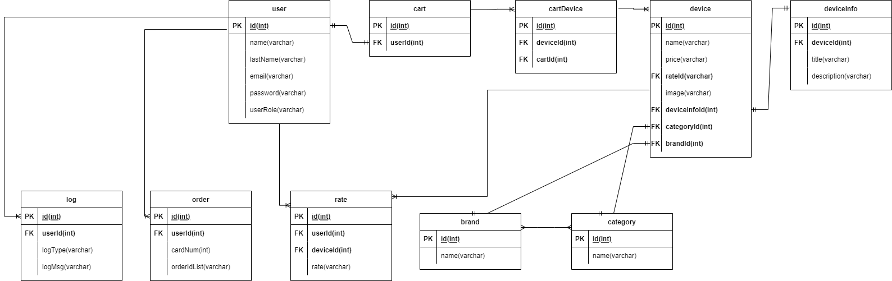

## Функциональные требования

* 1.Авторизация пользователя
* 2.Управление пользователями(CRUD)
* 3.Система ролей
* 4.Журналирование действий пользователей

## Список таблиц для бд
* 1.User - таблица пользователей
* 2.Basket - таблица корзин
* 3.BasketDevice - таблица устройств корзины
* 4.Device - таблица устройств
* 5.DeviceInfo - таблица названия/характеристик устройств
* 6.Category - таблица категорий устройств
* 7.Brand - таблица брендов устройств
* 8.Rate - таблица с рейтингом пользователей

## Схема бд

